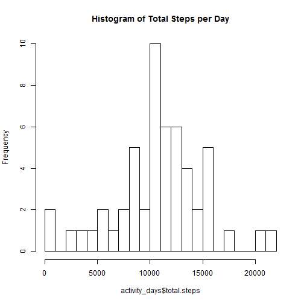
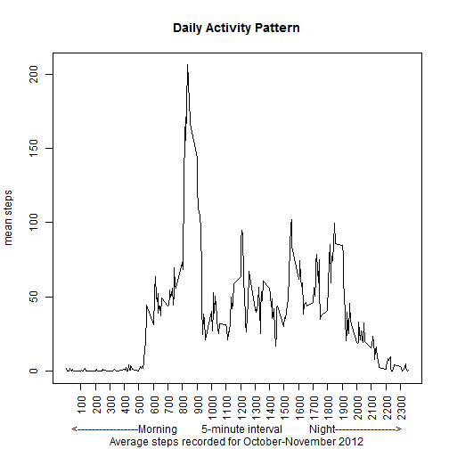
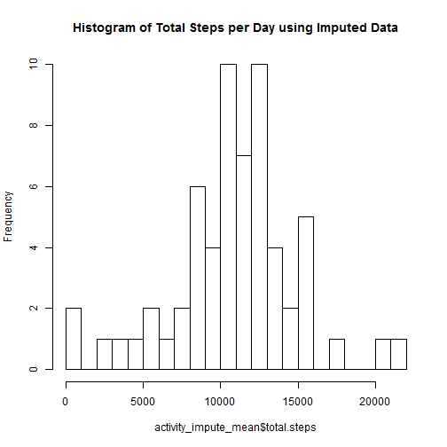
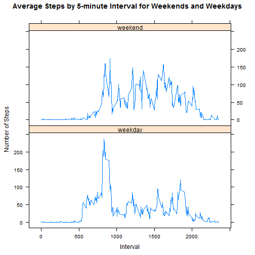

This R Markdown document is Bill Seliger's submission for Reproducible Research Peer Assessment 1. The course assignment can be found here <https://class.coursera.org/repdata-010/human_grading/view/courses/973511/assessments/3/submissions>

This assignment makes use of data from a personal activity monitoring device. This device collects data at 5 minute intervals throughout the day. The data consists of two months of data from an anonymous individual collected during the months of October and November, 2012 and include the number of steps taken in 5 minute intervals each day.  The original dataset can be found here <https://d396qusza40orc.cloudfront.net/repdata%2Fdata%2Factivity.zip>

The variables included in this dataset are:

- **steps**: Number of steps taking in a 5-minute interval (missing values are coded as NA)
- **date**: The date on which the measurement was taken in YYYY-MM-DD format
- **interval**: Identifier for the 5-minute interval in which measurement was taken
The dataset is stored in a comma-separated-value (CSV) file and there are a total of 17,568 observations in this dataset.

##Loading and preprocessing the data

Set the working directory on my local computer

```r
setwd("C:/Users/rr046302/Documents/Bill's Stuff/Coursera/Reproducible Research/RepData_PeerAssessment1")
```

Require several packages I will be using, set the scientific notation option, and read in the data from the local zipped file to the object activty, require the dplyr, ggplot2, and lattice packages, and, using the dplyr package, convert the activity object to a tbl class.  I have echo-FALSE and warning=FALSE to suppress echo and warning just for this code chunk.

```r
require("dplyr") ## dplyr is used for structuring the data for analysis
require("ggplot2") ## ggplot2 is required for several plots
require("lattice") ## lattice plot is required for the weekday-weekend plot
options(scipen = 999) ## eliminate scientific notation
```

```r
activity <- read.csv(unz("activity.zip","activity.csv")) ## read in the data
activity <- tbl_df(activity) ## structure the data as a tbl class
```

##What is mean total number of steps taken per day?

For this part of the assignment, you can ignore the missing values in the dataset.
Make a histogram of the total number of steps taken each day

First I aggregate the number of steps per day.  I use the group_by function and then the summarise function from dplyr to perform the aggregation of steps by day and last the hist function to create the histogram plot


```r
activity_days <- activity %>% group_by(date) %>% summarise(total.steps = sum(steps))
hist(activity_days$total.steps, breaks = 25, main = "Histogram of Total Steps per Day")
```

 

####Calculate and report the mean total number of steps taken per day

```r
mean((activity_days$total.steps), na.rm = TRUE)
```

```
## [1] 10766.19
```
####The mean number of steps taken per day is 10766

Calculate and report the median total number of steps taken per day

```r
median((activity_days$total.steps), na.rm = TRUE)
```

```
## [1] 10765
```
####The median number of steps taken per day is 10765


##What is the average daily activity pattern?

Create a factor of the interval - time of day - so that we can aggregate based on it

```r
activity$interval.factor <- as.factor(activity$interval)
```

Calculate the average number of steps for each interval using the group_by and summarise functions

```r
activity_interval <- activity %>% group_by(interval.factor) %>% summarise(mean.steps = mean(steps, na.rm =TRUE))
```

####Make a time series plot of the 5-minute interval (x-axis) and the average number of steps taken, averaged across all days (y-axis)


```r
activity_interval$interval <- as.numeric(as.character(activity_interval$interval.factor))
plot(activity_interval$interval, activity_interval$mean.steps, type = "l", xaxt="n", xlab = "<-----------------Morning         5-minute interval          Night----------------->", ylab = "mean steps", main = "Daily Activity Pattern", sub = "Average steps recorded for October-November 2012")
axis(1, at = seq(100, 2300, by = 100), las = 2)
```

 

####Which 5-minute interval, on average across all the days in the dataset, contains the maximum number of steps?

```r
max_steps_interval <- which.max(activity_interval$mean.steps)
print(activity_interval[max_steps_interval,])
```

```
## Source: local data frame [1 x 3]
## 
##   interval.factor mean.steps interval
## 1             835   206.1698      835
```
####The 5 minute interval with the maximum number of steps is 835 with 206.17 steps.


##Imputing missing values

There are a number of observations where there are missing values (coded as NA). The presence of missing data may introduce bias into some calculations or summaries of the data.

####Calculate and report the total number of missing values in the dataset (i.e. the total number of rows with NAs)


```r
sum(is.na(activity$steps))
```

```
## [1] 2304
```
####The number of rows with missing values (coded as NA) is 2304

##Create a new dataset with the missing data filled in.

After reviewing the data I found that the NAs consist of a specific set of dates for which no observations are recorded - in other words for each date for which there are observations there are no NAs and there are 8 days for which there are no observations at all - the observations for those 8 days are NAs.  

First I create a variable for day of week and order them so they appear in US order of weekday - weekend in plots (Monday-Sunday)

```r
activity$weekday <- weekdays(as.Date(activity$date))
activity$weekday <- factor(activity$weekday, levels= c("Monday", 
    "Tuesday", "Wednesday", "Thursday", "Friday", "Saturday", "Sunday"))
```

The number of missing observations is not the same across all weekdays.  Here I calculate the number of missing observations for each day of the week

```r
activity_day_NA <- activity %>% group_by(weekday) %>% summarise(sum(is.na(steps)))
print(activity_day_NA)
```

```
## Source: local data frame [7 x 2]
## 
##     weekday sum(is.na(steps))
## 1    Monday               576
## 2   Tuesday                 0
## 3 Wednesday               288
## 4  Thursday               288
## 5    Friday               576
## 6  Saturday               288
## 7    Sunday               288
```

In performing exploratory data analysis on the dataset I found that there are differences between the different weekdays for which we have observations.  

To show the variation in steps across each day of week/interval I create a facet plot of the mean steps for each interval for each weekday

```r
ggplot(data=activity_day, aes(x=interval, y=mean.steps)) + geom_line() + facet_wrap(~weekday) +
labs(title = "Mean steps per Interval for each day of the Week")
```

```
## Error in eval(expr, envir, enclos): object 'interval' not found
```

I will use the following strategy to impute missing values - calculate the average number of steps for each day of week/interval combination and complete the dataset by substituting this data for the NAs.  

First I calculate the interval average for each weekday for which we have observations

```r
activity_day <- activity %>% group_by(weekday, interval.factor) %>% summarise(mean.steps = mean(steps, na.rm =TRUE))
```

I then merge the original data table, activity, with the activity_day dataframe which has the average steps for each interval/day combination and then create the variable impute_steps which uses an ifelse statement to use the average number of steps if the original interval/dat combination is NA, else it uses the original steps for the interval/date combination.


```r
activity_impute <- merge(activity, activity_day, by=c("weekday","interval.factor"))
activity_impute$impute.steps <- ifelse(is.na(activity_impute$steps), activity_impute$mean.steps, activity_impute$steps)
```

####Make a histogram of the total number of steps taken each day and Calculate and report the mean and median total number of steps taken per day. Do these values differ from the estimates from the first part of the assignment? What is the impact of imputing missing data on the estimates of the total daily number of steps?

First I aggregate the number of steps per day.  I use the group_by function and then the summarise function from dplyr to perform the aggregation of steps by day and then hist function to create the histogram plot


```r
activity_impute_mean <- activity_impute %>% group_by(date) %>% summarise(total.steps = sum(impute.steps))
hist(activity_impute_mean$total.steps, breaks = 25, main = "Histogram of Total Steps per Day using Imputed Data")
```

 

####Calculate and report the mean total number of steps taken per day

```r
mean(activity_impute_mean$total.steps)
```

```
## [1] 10821.21
```
####The mean number of steps taken per day is 10821

####Calculate and report the median total number of steps taken per day

```r
median(activity_impute_mean$total.steps)
```

```
## [1] 11015
```
####The median number of steps taken per day is 11015

Because I used an impute strategy that is granular, i.e. imputing at each day of the week and interval and the number of missing observations varies across the days of the week the imputation strategy does impact the mean and median steps across the entire data set.  

Here I show the mean steps for each weekday prior to imputation (which is the same as the average after imputation) - because the missing observations varied across the weekdays the imputation strategy did impact the post-imputation Histogram, Mean and Median

```r
activity_day_mean <- activity %>% group_by (date, weekday)  %>%  summarise(total.steps = sum(steps)) %>% 
  group_by (weekday) %>% summarise(mean.steps = round(mean(total.steps, na.rm = TRUE),0))
print(activity_day_mean)
```

```
## Source: local data frame [7 x 2]
## 
##     weekday mean.steps
## 1    Monday       9975
## 2   Tuesday       8950
## 3 Wednesday      11791
## 4  Thursday       8213
## 5    Friday      12360
## 6  Saturday      12535
## 7    Sunday      12278
```

I believe this imputation strategy is supported by the data.

##Are there differences in activity patterns between weekdays and weekends?

For this part the weekdays() function may be of some help here. Use the dataset with the filled-in missing values for this part.

Create a new factor variable in the dataset with two levels - "weekday" and "weekend" indicating whether a given date is a weekday or weekend day.


```r
activity_impute <- activity_impute %>% mutate(weekend = ifelse(weekday == "Saturday" | weekday == "Sunday", "weekend", "weekday"))
```


Make a panel plot containing a time series plot (i.e. type = "l") of the 5-minute interval (x-axis) and the average number of steps taken, averaged across all weekday days or weekend days (y-axis). See the README file in the GitHub repository to see an example of what this plot should look like using simulated data.


```r
activity_impute_mean <- activity_impute %>% group_by(weekend, interval) %>% summarise(mean.steps = mean(impute.steps))
xyplot(mean.steps ~ interval | weekend, data = activity_impute_mean, type = "l", layout = c(1,2), xlab = "Interval", ylab = "Number of Steps", main = "Average Steps by 5-minute Interval for Weekends and Weekdays")
```

 

There exist clear difference in activity between weekends and weekdays, which is understandable as most people are more active in the weekends than they are during the week.  
